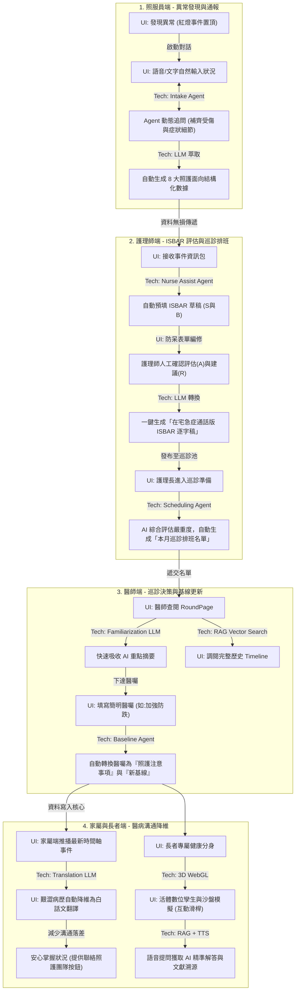
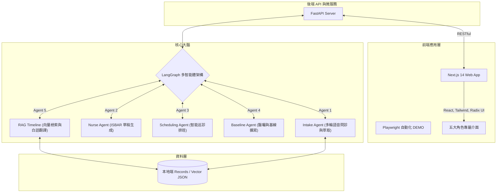

# OMNI-TWIN: 紀錄隨人走 (Record Follows Person)

 

## 📌 問題與解法摘要

**【真實問題定義與影響力】**
因應「長照十年計畫 3.0」與「醫照整合」趨勢，長照機構面臨嚴峻挑戰。實務上，照服員發現長者異常後，需先通報護理師，護理師再轉報醫師，最後還要負責與家屬溝通。這條漫長且跨專業的傳遞鏈，經常導致**資訊傳遞失真**與**溝通誤差**。加上長期以來「照護員人力嚴重不足」，繁瑣的紙本行政與交班紀錄更大幅壓縮了實質照護品質。

**【使用者需求與創新解法】**
本專案打造「OMNI-TWIN 活體數位孿生」系統，實現「紀錄隨人走」。
透過導入 **LangGraph 多智能體 (Multi-Agent)**，我們徹底翻轉傳統流程：照服員只需使用自然語音通報，AI 即會自動動態追問並萃取結構化資料；護理師端自動生成 ISBAR 草稿與巡診基線；醫師端提供 RAG 時間軸快查；家屬端則自動推播「無障礙的白話文翻譯」。有效減少跨職類資訊失真、大幅降低前線行政負擔，真正落實 AI for Taiwan 的醫照整合願景。

---

## 👥 UI/UX 與 AI Agent 跨角色互動流程圖

為解決傳統通報流程的「資訊斷層」，OMNI-TWIN 透過 AI Agent 串聯 5 大角色，將事件從發生、評估、決策到家屬溝通形成完美的閉環 (Closed-loop)。



### 💡 核心 UI/UX 前端設計亮點
1. **技術透視標籤 (TechTags)**：在系統各處佈建毛玻璃 Tooltip，明確標示背後運作的 AI 引擎 (如 RAG, TTS, LangGraph)，增加系統透明度與信任感。
2. **AI 智能排班與名單生成**：打破傳統人工撈資料排班，護理長介面具備一鍵「產生本月名單」，由 AI 自動根據近期紅燈事件與嚴重度進行巡診排序。
3. **列印友善設計 (Print-Friendly)**：針對不熟悉數位系統的資深醫師，提供 A4 巡診單一鍵列印功能，並透過 CSS `@media print` 完美隱藏選單與 UI 按鈕。
4. **3D WebGL 沙盤模擬**：匯入 `.glb` 模型打造數位孿生，使用者可透過拖曳滑桿 (如：減少睡眠) 即時預覽健康數值對身體狀態的直觀影響。
5. **防呆語音輸入 (Voice-First)**：照服員 STT 語音辨識結束後，輸入框會自動呈現紅框與提示字眼，確保送出前的人工覆核。
6. **長者無障礙與 RBAC 權限隔離**：不同角色登入後自動切換不同視圖；長者端具備超大字體與直覺的語音播報 (TTS)。

---

## 🏗️ 系統架構圖 (System Architecture)

系統採用前後端分離設計。前端 Next.js 確保優良使用者體驗，並透過 Python FastAPI 介接AI Agent 智慧引擎。
**資料庫與狀態管理：** 為兼顧隱私與便利性，使用輕量級本地端 JSON File System (儲存健康數據與時間軸事件) 以及 SQLite (管理 LangGraph AI 代理的對話狀態) 作為雙核心資料庫解決方案。



---

## 📂 專案資料夾架構 (Repository Structure)

為確保開源社群與評審能輕鬆 Clone 並 100% 重現專案，我們移除了冗餘檔案，保留核心架構如下：

```text
📦 Communication-in-Healthcare
├── 📂 apps
│   ├── 📂 web                  # 前端 (Next.js) 與 UI 元件
│   │   ├── 📂 app              # Next.js App Router (五大角色介面路由)
│   │   ├── 📂 components       # 共用元件 (包含 TechTag, 3D 模型渲染器)
│   │   ├── 📂 public/models    # 數位孿生 3D 模型檔 (.glb)
│   │   └── package.json        # 前端套件依賴設定檔
│   └── 📂 api                  # 後端 (FastAPI + LangGraph)
│       ├── main.py             # FastAPI 伺服器入口點
│       ├── agents/             # LangGraph 核心邏輯 (Intake, Nurse 等)
│       └── requirements.txt    # Python 核心依賴 (可用 uv 快速安裝)
├── 📂 data
│   └── 📂 seed
│       └── seed.py             # 🚀 初始化腳本：一鍵生成 14 天展示用乾淨資料
├── 📂 records                  # 輕量級本地端資料庫 (存放 JSON 事件與向量數據)
├── Makefile                    # 封裝好的環境重置指令 (make reset)
├── .env.example                # 環境變數範例檔 (請在此填入 OPENAI_API_KEY)
└── README.md                   # 本專案說明文件
```

---

## 🚀 執行方式 (How to Run)

本專案經過嚴格打包，具備極高的可重現性 (Reproducibility)。請依照以下步驟啟動專案：

### 1. 環境需求準備
* Node.js (v18+)
* Python (v3.10+)
* [uv](https://github.com/astral-sh/uv) (極速 Python 套件管理器)

### 2. 本機端啟動教學

打開終端機，首先 clone 專案並安裝前端依賴：
```bash
git clone https://github.com/chenni416/Communication-in-Healthcare.git
cd Communication-in-Healthcare/apps/web
npm install
```

**步驟 A：啟動後端 API (FastAPI + LangGraph)**
請開啟第一個終端機視窗：
```bash
cd apps/api
# 使用 uv 啟動 FastAPI 伺服器
uv run uvicorn main:app --reload --port 8000
```

**步驟 B：啟動前端介面 (Next.js)**
請打開第二個終端機視窗，我們提供多種前端啟動方式：

標準啟動方式：
```bash
cd apps/web
pnpm dev
```

🌟 網站將會運行於：`http://localhost:3000`

---

## 📜 來源說明與開源授權 (Acknowledgments & License)

確保開源品質與第三方授權完整性，本專案聲明如下：

* **原始碼授權**: 本專案採 [MIT License](LICENSE) 開源。
* **UI 框架與圖示**: 採用開源相容授權之 Radix UI, Tailwind CSS 與 Lucide Icons。
* **3D 模型與資源**: 本專案前端使用之數位孿生人體模型 (`.glb`) 來自 [Ready Player Me](https://sketchfab.com/readyplayerme) 企業開放資源：[Full-body Cyberpunk Male](https://sketchfab.com/3d-models/full-body-cyberpunk-male-d4f0c20eccc04e10876c25dfb54c98fe)，依其開源授權規範使用。
* **LLM API**: 系統大腦依賴 OpenAI API (如 GPT-4o) 進行代理決策，重現專案前請於 `.env` 中設定有效的 `OPENAI_API_KEY`。
